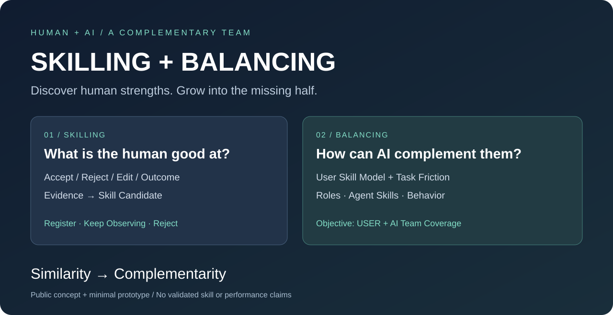
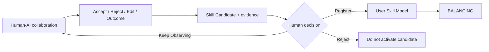
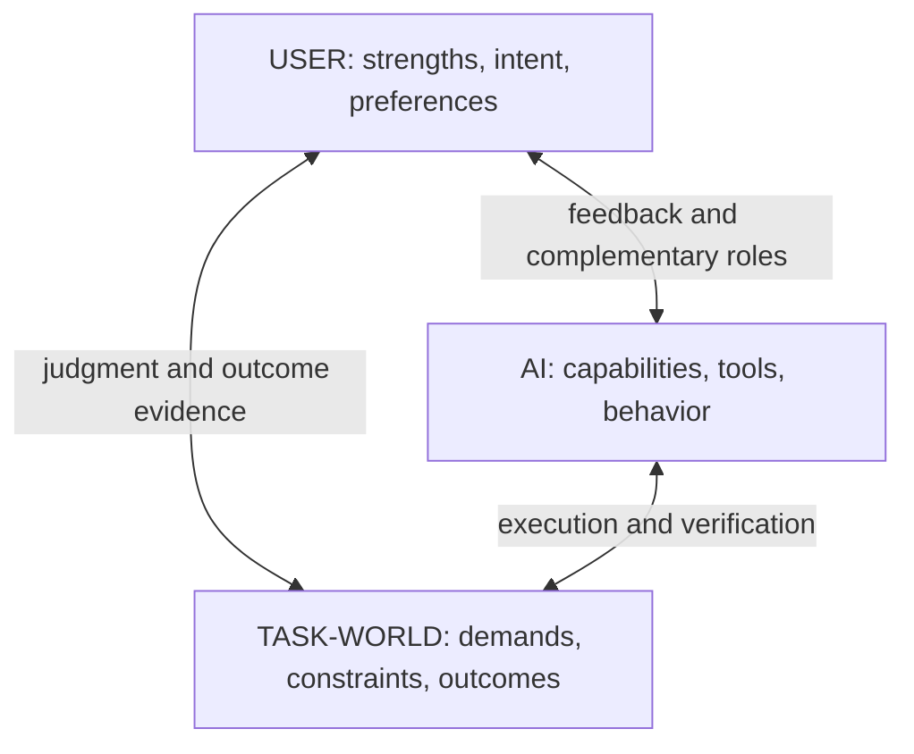

<p align="center"></p>

# SKILLING + BALANCING

**Discover what the human is good at, then let the AI grow into the missing half.**

`Similarity -> Complementarity`

[日本語](README_JA.md) · [Run the demo](#quick-start) · [Design & limits](docs/DESIGN.md) · [Contribute](CONTRIBUTING.md)

**Agent skills teach AI what it can do. SKILLING discovers what the human can do.**

An early concept and a tiny, runnable Python prototype for complementary Human–AI collaboration. No API key. No dependencies. No telemetry.

## Why this exists

A person repeatedly notices that the camera is too high, the lens feels wrong, or the subject disappears into the background. The AI revises the work. Outcomes improve. Those judgments may reveal a useful, repeatable skill—even if the person has never named it.

**SKILLING** proposes a skill candidate from this evidence. **BALANCING** asks how the AI can support that strength and cover the remaining work. The goal is better **USER + AI Team Coverage**, not a more accurate imitation of the user.

| Approach | Main question | Result |
| --- | --- | --- |
| Preference personalization | What does this person like? | Adapted choices and presentation |
| Agent skills | What can the AI execute? | Tools, procedures and reusable capabilities |
| SKILLING | What can this person judge or do well, repeatedly? | Evidence-backed User Skill Candidates |
| BALANCING | What should each partner do for this task? | Complementary roles, Agent Skills and Behavior |

These are design distinctions, not claims that existing research never overlaps. This project makes no world-first or validated-performance claim. SKILLING is not MBTI, a personality diagnosis, or an employee ranking system.

## See the idea in 30 seconds

```text
SKILL CANDIDATE: Visual Composition
Evidence      47
Successful    39
Confidence    83%
Frequent signals
  Camera height / Lens choice / Subject separation / Lighting

[Register]  [Keep Observing]  [Reject]
```

**Synthetic example, not a measured result.** Here “Confidence” is only the rounded observed success ratio, 39 / 47. It is not an 83% probability that someone has a skill. Acceptance alone is not success; each observation also needs an outcome assessment.

After **Register**, an illustrative BALANCING rule assigns visual direction to the human, repetitive variants and verification to the AI, and keeps costly changes behind human approval. Observe and Reject do not activate this role assignment.

## Quick Start

Python **3.10+**, standard library only:

```bash
git clone https://github.com/letssliponbananapeel-art/skilling.git
cd skilling
python3 demo.py
python3 demo.py --decision register
python3 demo.py --decision reject --json
python3 -m unittest discover -s tests -v
```

On Windows, use `py -3` if `python3` is unavailable. `--decision observe` means **Keep Observing** and is the default. Decisions are in memory for this run; nothing is saved or uploaded. Use `--data path/to/events.json` to inspect another file with the same schema.

## SKILLING: evidence → candidate → human confirmation

Observe **Accept / Reject / Edit / Outcome** during joint work. Look for repeatable judgment ability and tacit knowledge, including abilities the user has not explicitly described. Show **Evidence / Successful / Confidence / Frequent signals**, then let the person **Register / Keep Observing / Reject**.



**Preference stays separate:** “I like blue” is not evidence of composition expertise. A correction that improves a specified outcome may be evidence, but needs repetition and context. The demo filters an explicit preference event out of the evidence count.

## BALANCING: complement the human

BALANCING combines a **User Skill Model** with task-specific friction: **Capability Gap, Task Frequency, Failure Cost, User Stress and Preference**. It adjusts proposed **roles, Agent Skills and Behavior** toward broader joint coverage. Coverage means how much of the task's required work the team can reliably handle together; maximizing it is an objective, not a demonstrated result here.

The human can keep a preferred task even when the AI can perform it. Stress is supplied by the user, not diagnosed from writing style. High failure cost calls for additional checks and explicit review, not automatic delegation.

### The Relationship Triangle



The task-world provides the outcome anchor. Agreeing with the user is not enough to show improvement.

## What actually works today

- An offline fixture of 47 explicitly tagged judgments and one separate preference event.
- Aggregation into a candidate, three decision states, and inspectable JSON output.
- Transparent illustrative BALANCING rules that respond to the supplied friction fields.
- Tests for counts, missing evidence, preferences, rejected candidates and role changes.

**Not implemented:** automatic discovery of unnamed skills from raw conversation, calibrated uncertainty, long-term model persistence, real agent execution, or an optimization algorithm for Team Coverage. The demo groups already tagged evidence; it does not prove the full concept. See [the design notes](docs/DESIGN.md).

## Relationship to Slime-core / ELFCORE

This is a standalone public concept lab in the broader ELFCORE direction. [Slime-core](https://github.com/letssliponbananapeel-art/Slime-core) is the related public local-AI application. This repository does not require it or claim an existing runtime integration. ELFCORE internals, private data and advanced BALANCING algorithms are outside this release.

## Roadmap

- [x] Bilingual concept, relationship diagrams and dependency-free demo.
- [x] Human confirmation gate and synthetic outcome evidence.
- [ ] Evidence schema with context, provenance, consent and deletion.
- [ ] Compare candidate discovery against preference-only and static-role baselines.
- [ ] Evaluate on held-out tasks with independent outcome ratings.
- [ ] Measure team coverage, correction burden and user-rated stress.
- [ ] Explore an opt-in integration boundary with the ELFCORE ecosystem.

These are research directions, not promised delivery dates.

## Help shape it

**If you want AI that complements people, star this repository to follow the experiment.** Try the demo, challenge the distinction, or contribute a synthetic example where “accepted” does **not** mean “better.” See [CONTRIBUTING](CONTRIBUTING.md). Real evidence and thoughtful counterexamples are more useful than inflated scores.

## License & scope

This public prototype, accompanying docs and diagrams use **[MPL-2.0](LICENSE)**. Commercial use is allowed, including by third parties. Distributed modifications to covered files remain subject to MPL; separate proprietary files can remain under their own terms. It is not a noncommercial or anti-competition license.

The grant covers this repository's materials; it does not publish or license absent ELFCORE implementation files. Public disclosure is not a way to preserve secrecy, and this license does not establish ownership of the underlying concepts. See [licensing rationale and alternatives](docs/LICENSING.md).
