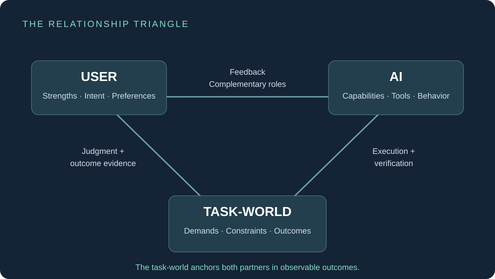
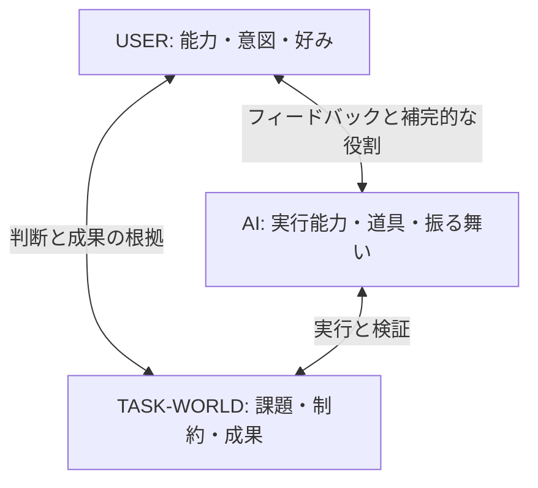

# SKILLING + BALANCING


**人間の得意を発見し、AIが足りない半分へ育つ。**

`Similarity -> Complementarity` — 類似から補完へ。

[English](README.md) · [設計と制約](docs/DESIGN.md) · [貢献方法](CONTRIBUTING.md)

> Agent skills teach AI what it can do. SKILLING discovers what the human can do.

Agent SkillsはAIに「何ができるか」を教え、SKILLINGは人間の「何ができるか」を発見します。

## 何をするもの？

**SKILLING**は、人間とAIの共同作業中の **Accept / Reject / Edit / Outcome** から、本人も明示していない再現可能な判断能力・暗黙知を **Skill Candidate** として発見する構想です。Evidence / Successful / Confidence / Frequent signalsを示し、本人が **Register / Keep Observing / Reject** を選びます。

**BALANCING**は、確認されたUser Skill Modelと **Capability Gap / Task Frequency / Failure Cost / User Stress / Preference** などのFrictionから、役割・Agent Skill・Behaviorを補完方向へ調整する構想です。目的は **USER + AIのTeam Coverage** を最大化すること。ユーザーをコピーすることではありません。

| 仕組み | 問うこと |
| --- | --- |
| Preference学習 | 何が好きか |
| Agent Skills | AIが何を実行できるか |
| SKILLING | 人間が何を繰り返し上手く判断できるか |
| BALANCING | 今の課題で互いが何を担当するとよいか |

これは設計上の整理であり、既存研究と重ならない、世界初である、効果を実証したという主張ではありません。MBTI・性格診断・人事評価とも分離します。

## 30秒で試す

Python 3.10以上。追加ライブラリ・APIキー不要。通信・テレメトリなし。

```bash
git clone https://github.com/letssliponbananapeel-art/skilling.git
cd skilling
python3 demo.py
python3 demo.py --decision register
python3 demo.py --decision reject --json
python3 -m unittest discover -s tests -v
```

Windowsでは必要に応じて `py -3` を使います。`--data path/to/events.json` で同形式のデータを指定できます。

```text
SKILL CANDIDATE: Visual Composition
Evidence      47
Successful    39
Confidence    83%
Camera height / Lens choice / Subject separation / Lighting
[Register]  [Keep Observing]  [Reject]
```

**すべて合成サンプルです。実際のユーザー能力の測定結果ではありません。** 83%は39÷47の四捨五入で、能力がある確率や統計的に校正された確信度ではありません。採用されたことと成果が改善したことも別です。

`register` でのみ、視覚的な最終判断を人間、反復案作成と検証をAIへ割り当てる簡単なルールが動きます。初期値の `observe` は観測継続、`reject` は不採用です。判断は実行中だけ有効で、保存もアップロードもしません。

## Relationship Triangle



<details>
<summary>Editable Mermaid source</summary>



</details>

TASK-WORLDの成果を確認することで、単なる同意と改善を区別します。「青が好き」はPreferenceであり、構図の能力とは数えません。デモでも好みのイベント1件を47件のEvidenceから除外しています。ストレスは本人が伝える情報とし、文体から診断しません。

## 今回の公開範囲

実装済みは、タグ付きの合成判断47件の集計、候補表示、本人の3つの選択、Frictionに応じた単純な役割提案とテストです。

**生の会話から未知の能力を自動発見する機能、校正された確信度、永続保存、Agentの実行、Team Coverageの最適化は未実装です。** このプロトタイプで構想全体の有効性が証明されたわけではありません。

[Slime-core](https://github.com/letssliponbananapeel-art/Slime-core) / ELFCOREと関連する独立した公開コンセプトです。Slime-coreなしで動き、既存連携を前提としません。ELFCORE本体・高度なBALANCINGアルゴリズム・実ユーザーデータは含みません。

## Roadmap

- [x] 日英README、概念図、依存なしのPythonデモ
- [x] 本人確認と合成成果データ
- [ ] 同意・削除・由来・文脈を含むEvidence形式
- [ ] Preferenceのみ／固定役割との比較
- [ ] 未使用の課題と独立した成果評価で検証
- [ ] Team Coverage、修正負担、本人申告ストレスの測定
- [ ] ELFCOREとの任意連携の検討

未実装項目は研究・開発の方向性です。納期の約束ではありません。

## 参加する

人を補完するAIに関心があれば、**Starで今後の実験を追ってください。** 「採用したが改善していない」反例や、個人情報を含まない合成サンプルを歓迎します。[Contributing](CONTRIBUTING.md)を参照してください。

## ライセンス

公開プロトタイプと付属文書・図は **[MPL-2.0](LICENSE)**。第三者を含め商用利用可能です。配布する改変済み対象ファイルにはMPLの条件が適用されますが、別の独立した非公開ファイルを一律に公開させるものではありません。商用禁止ライセンスではありません。

公開していないELFCORE本体のファイルをこのリポジトリが公開・許諾することはありません。一方、公開した概念の秘密性や独占権をライセンスで確保するものでもありません。[選定理由と代替案](docs/LICENSING.md)。
